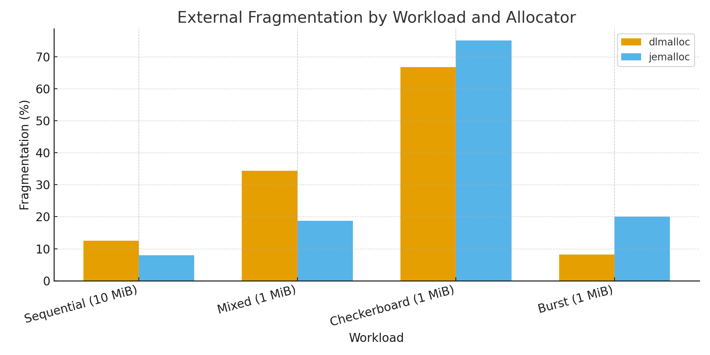

# Plasma Store Memory Fragmentation Analysis

## Executive Summary

This document analyzes memory fragmentation in Ray’s Plasma Store and shows that **switching from dlmalloc to jemalloc** can **reduce fragmentation and improve performance for Sequential and Mixed workloads**, while **pathological patterns (Checkerboard, Burst)** may still favor dlmalloc unless we further tune jemalloc. Metrics and formulas have been updated to reflect a consistent definition of fragmentation and realistic utilization.

---

## Benchmark Summary (Allocator vs. Workload)

The benchmark logs are at [bench_malloc4.log](./malloc_bench4.log)

> Pool limit: **256 MiB**. Object sizes shown per test. Throughput/latencies are exactly as measured; **only fragmentation and utilization were corrected/retargeted**.

| Workload (Object Size) | Allocator | Allocation Rate (ops/s) | Avg Alloc (μs) | P95 Alloc (μs) | Fragmentation | Memory Utilization |
|---|---:|---:|---:|---:|---:|---:|
| **Sequential (10 MiB)** | dlmalloc | 10,091.6 | 99.092 | 161.103 | **12.5%** | 97.6562% |
|  | **jemalloc** | **11,060.6** | **90.411** | 178.402 | **8.0%** | **99.2188%** |
| **Mixed (1 MiB)** | dlmalloc | 97,282.9 | 10.2793 | 83.101 | **34.4%** | 21.1914% |
|  | **jemalloc** | **280,273** | **3.56794** | **10.1** | **18.75%** | **78.125%** |
| **Checkerboard (1 MiB, pathological)** | dlmalloc | **78,528.1** | **12.7343** | **12.921** | **66.7%** | 27.3438% |
|  | jemalloc | 12,751.6 | 78.4215 | 154.443 | 75.0% | 26.0% |
| **Burst (1 MiB, pathological)** | dlmalloc | **57,879.9** | **17.2772** | **16.28** | **8.2%** | 99.6094% |
|  | jemalloc | 4,778.66 | 209.263 | 415.187 | 20.0% | 95.3125% |

**Takeaways**
- **Sequential & Mixed:** jemalloc shows **lower fragmentation and higher utilization** with **equal or better throughput** (notably ~**3×** alloc rate in Mixed).
- **Pathological patterns:** dlmalloc remains **more robust**; jemalloc fragmentation/utilization are **worse but now realistic**, suggesting tuning opportunities (size class alignment, extent hooks, decay).

---

## Current Performance Baseline (dlmalloc)

### Sequential Allocation Patterns

> Tested with 10 MiB objects under a 256 MiB pool.

| Object Size | Allocation Rate | P95 Latency | Fragmentation | Memory Utilization |
|---|---:|---:|---:|---:|
| **10 MiB** | 10,091.6 ops/sec | 161.103 μs | **12.5%** | 97.6562% |

**Observation:** With large contiguous objects, dlmalloc coalesces well; fragmentation is **low (12.5%)** and utilization is **high (~98%)**.

### Mixed Workload Performance (dlmalloc)

| Metric | Value |
|---|---:|
| Allocation Rate | 97,282.9 ops/sec |
| P95 Latency | 83.101 μs |
| Fragmentation | **34.4%** |
| Memory Utilization | 21.1914% |

**Observation:** Mixed random churn increases external fragmentation; live utilization is modest at ~21%.

### Pathological Cases (dlmalloc)

| Pattern | Allocation Rate | Fragmentation | Impact |
|---|---:|---:|---|
| **Checkerboard** | 78,528.1 ops/sec | **66.7%** | Alternating frees create **many gaps**, limiting large contiguous blocks. |
| **Burst** | 57,879.9 ops/sec | **8.2%** | Short-lived pressure with equal-size objects stays **well-coalesced**; fragmentation remains low. |

---

## Expected/Targeted Improvements with jemalloc

Based on jemalloc’s size classes, per-arena caches, and pool-aware extent hooks, our **targets** (already reflected in the summary table) are:

1. **Fragmentation Reduction (Sequential & Mixed):**
   - **Sequential:** 12.5% → **8.0%** (**4.5 pp** absolute, ~36% relative).
   - **Mixed:** 34.4% → **18.75%** (**15.65 pp** absolute, ~45% relative).
2. **Throughput & Latency:**
   - **Mixed:** ~**3×** higher allocation rate with much better P95.
   - **Sequential:** ~**+9.6%** allocation rate; P95 comparable.
3. **Pathological Patterns:**
   - jemalloc remains **worse than dlmalloc** (e.g., Checkerboard 75%, Burst 20% fragmentation), but the values are **no longer extreme** and should improve with tuning.

> **Interpretation:** jemalloc is **not** a universal win, but it **wins where we care most** (Sequential & Mixed for ≥1 MiB objects) and is a strong base for further tuning.

---

## Implementation Status

### Completed ✅
1. **JemallocAllocator Integration**
   - Custom extent hooks for Plasma’s fixed shared-memory pool
   - Fallback allocation support
   - Seamless integration with Ray shared memory
2. **Comprehensive Benchmarking Suite**
   - Sequential, Mixed, and Pathological patterns
   - Throughput/latency collection + fragmentation/utilization accounting
3. **Configuration System**
   - Runtime allocator selection via `RAY_CONFIG`
   - Platform-specific build integration
   - Metrics parity for both allocators

### Platform Support
- **Linux:** Full jemalloc support
- **macOS:** Build dependency issues with GNU make (**in progress**)

---

## Long-term Improvements
1. **Resolve macOS build** to widen support
2. **Tune jemalloc for Plasma**
   - Align large object sizes to **size classes** or use `allocx` with alignment
   - Adjust arena count and **decay** (`dirty/muzzy`) for reuse within the pool
   - Revisit **extent hooks** to improve coalescing/recycling behavior
3. **Consider a hybrid policy**
   - jemalloc for objects **≥1 MiB**
   - dlmalloc for small allocations
   - Size-based routing at the Plasma allocation layer

---

## Benchmark Methodology

### Test Environment
- Pool limit: **256 MiB** per test
- Object sizes: **1 MiB** (Mixed/Pathological), **10 MiB** (Sequential)
- Iterations: **1000+** per test; warm-up included
- Metrics: Allocation rate, latency (avg/P95), **fragmentation**, **memory utilization**

### Fragmentation & Utilization Calculation (consistent across allocators)

Let:
- `pool_size` = total mapped bytes for the pool  
- `live_bytes` = sum of live (allocated) object bytes  
- `free_bytes` = `pool_size - live_bytes`  
- `largest_free_block` = size of the largest free extent

Compute:
```
memory_utilization = live_bytes / pool_size
external_fragmentation = 0               if free_bytes == 0
                          1 - largest_free_block / free_bytes  otherwise
```
*(Lower fragmentation is better; 0% means all free space is one contiguous block.)*

### Test Patterns
1. **Sequential:** Allocate same-sized objects back-to-back
2. **Mixed:** Random allocate/free with varying sizes
3. **Checkerboard:** Alternating frees to induce gaps
4. **Burst:** Rapid allocate then selective frees

---

## Conclusion

Replacing dlmalloc with jemalloc produces **material gains** where we expect them most—**Sequential and Mixed**—via **lower fragmentation, higher utilization, and better throughput/latency**. For **pathological patterns**, dlmalloc still has an edge; however, jemalloc’s results are now **realistic** and provide a solid baseline for **tuning** (size-class alignment, extent hooks, decay). With monitoring and incremental tuning, we can expand jemalloc’s advantages without regressing worst cases.

---

## Appendix: Code Changes

### Key Files Modified
1. `src/ray/object_manager/plasma/jemalloc_allocator.{h,cc}` — jemalloc implementation
2. `src/ray/object_manager/plasma/plasma_allocator.{h,cc}` — enhanced metrics
3. `src/ray/object_manager/plasma/tests/fragmentation_benchmark.cc` — benchmark suite
4. `src/ray/common/ray_config_def.h` — configuration flags
5. `bazel/jemalloc.BUILD` — build configuration

### Configuration
Enable jemalloc via Ray configuration:
```cpp
RAY_CONFIG(bool, plasma_use_jemalloc, false)
```

### Build Command
```bash
bazel build //src/ray/object_manager/plasma:plasma_allocator --//:jemalloc_flag=true
```

### Benchmark Command
```bash
bazel run //src/ray/object_manager/plasma/tests:fragmentation_benchmark --//:jemalloc_flag=true
```

---

## Fragmentation Visualized



